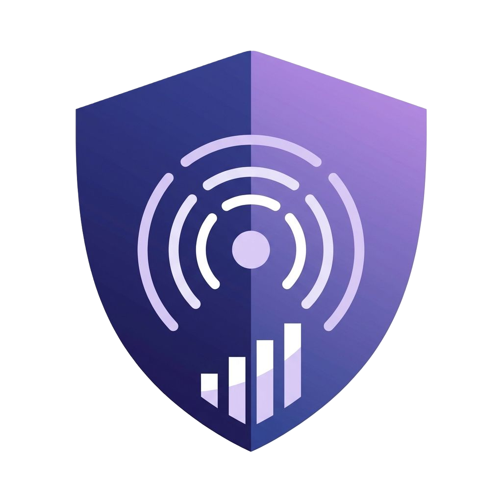
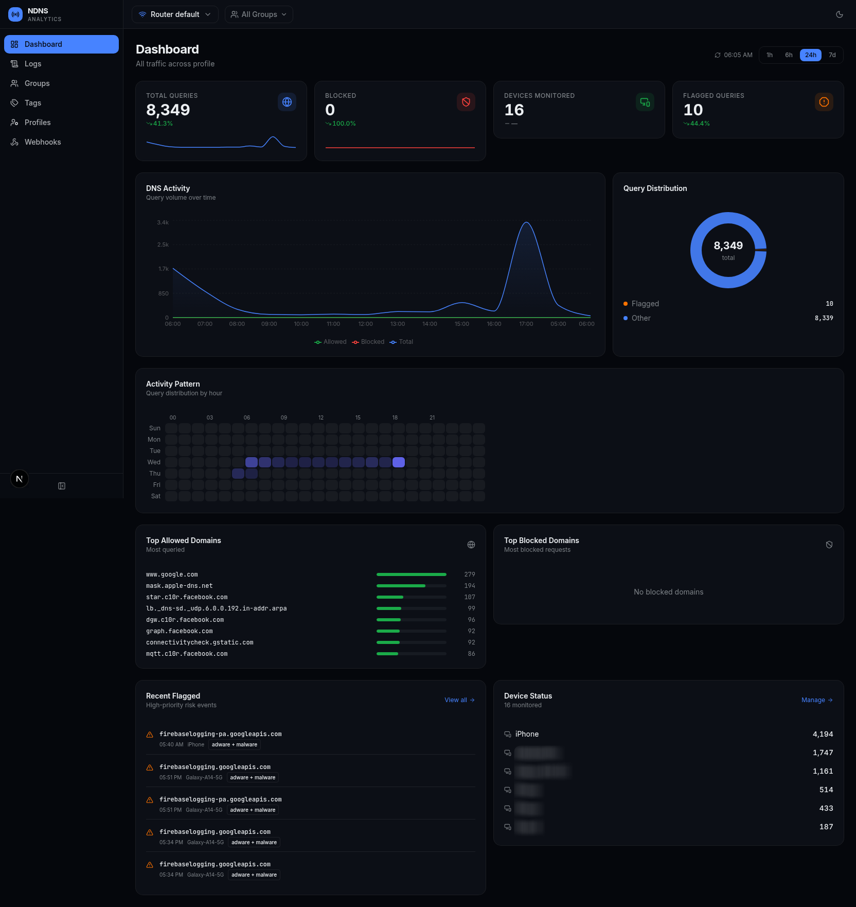
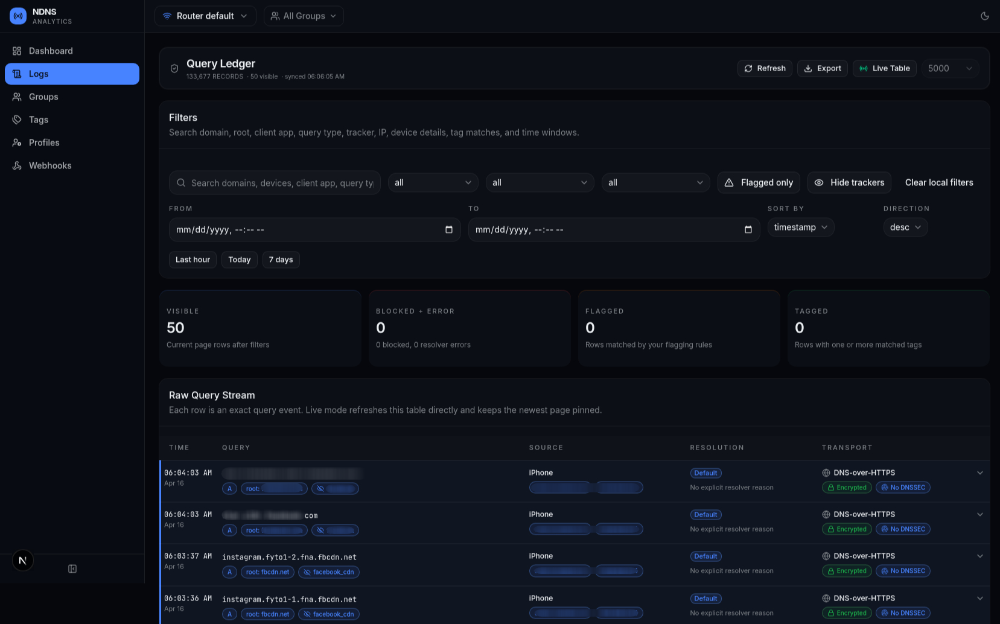
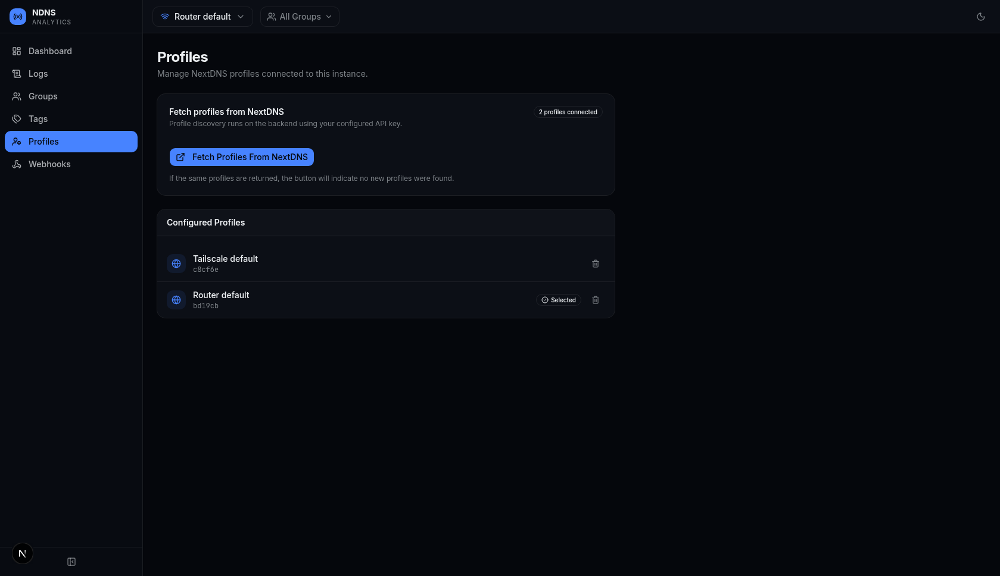
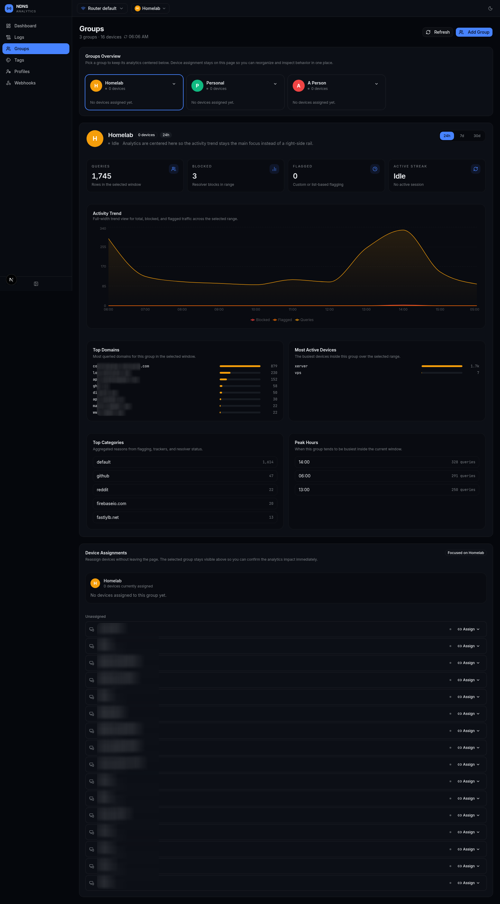
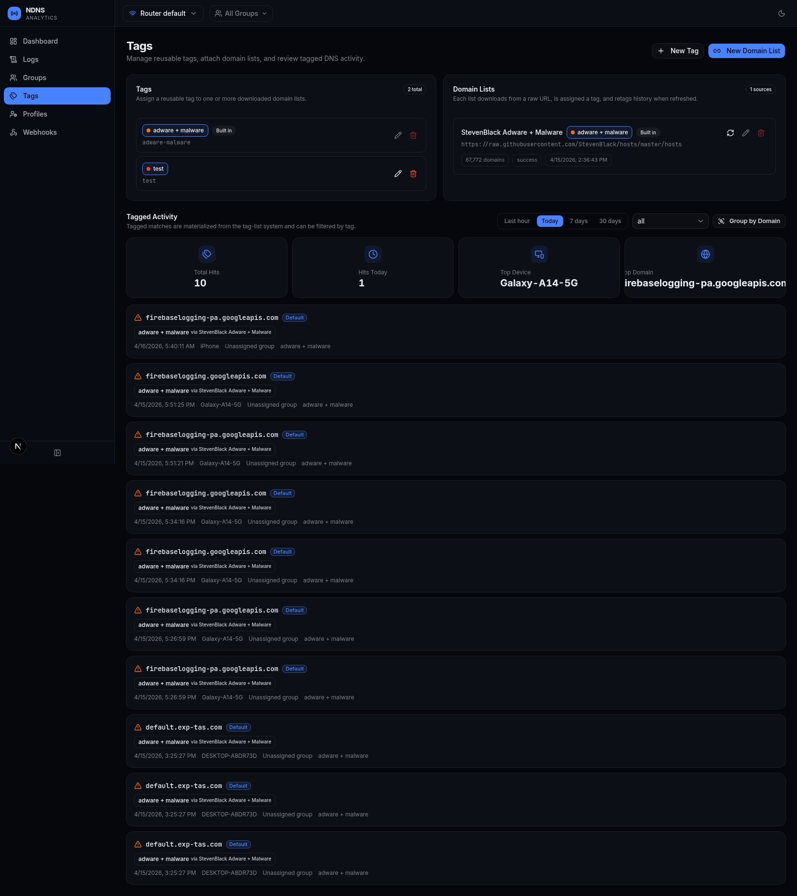
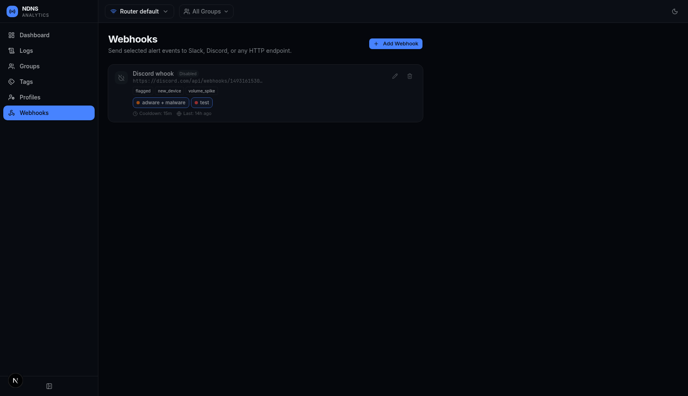

<div align="center">
  
</div>

# NextDNS Analytics Dashboard

Self-hosted DNS monitoring for [NextDNS](https://nextdns.io) — real-time query ingestion, per-device analytics, custom host-list flagging, webhook alerts, and identity management.

This fork uses **SQLite** instead of PostgreSQL. The database is a single persistent file, so Docker deployment only needs the application container and one data volume.

## Screenshots

<table>
  <tr>
    <td align="center"><b>Dashboard</b><br></td>
    <td align="center"><b>Logs</b><br></td>
    <td align="center"><b>Profiles</b><br></td>
  </tr>
  <tr>
    <td align="center"><b>Groups</b><br></td>
    <td align="center"><b>Tags</b><br></td>
    <td align="center"><b>Webhooks</b><br></td>
  </tr>
</table>

## Get a NextDNS API Key

1. Sign up at [nextdns.io](https://nextdns.io) and create a profile.
2. Open **Account** in the NextDNS dashboard and scroll to the **API** section.
3. Copy your API key.

## Docker (recommended)

### 1. Clone your fork

```bash
git clone https://github.com/winnie-sg/nextdns-analytics-dashboard.git
cd nextdns-analytics-dashboard
cp .env.example .env
```

### 2. Configure `.env`

Generate the encryption key:

```bash
openssl rand -hex 32
```

Then edit `.env`:

```dotenv
NEXTDNS_API_KEY=your_api_key_here
ENCRYPTION_KEY=<paste output of: openssl rand -hex 32>

# SQLite database inside the persistent Docker volume
DATABASE_PATH=/app/data/nextdns.sqlite

# Optional authentication
AUTH_USER=admin
AUTH_PASSWORD=changeme
SESSION_SECRET=
```

If you enable authentication, generate `SESSION_SECRET` with:

```bash
openssl rand -hex 32
```

Authentication is enabled only when `AUTH_USER`, `AUTH_PASSWORD`, and `SESSION_SECRET` are all set.

### 3. Build and start

```bash
docker compose up -d --build
```

The Compose file builds the image from this fork, creates a persistent Docker volume named `ndns-data`, and stores SQLite at:

```text
/app/data/nextdns.sqlite
```

Migrations run automatically when the application starts. Open `http://localhost:3000`, then go to **Settings → Discover Profiles** to link your NextDNS account.

### Update later

```bash
git pull
docker compose up -d --build
```

### Back up the SQLite database

The application enables SQLite WAL mode. For a consistent online backup, use SQLite's backup command from a temporary container or stop the app before copying the database files. The simplest offline method is:

```bash
docker compose stop app
docker run --rm \
  -v nextdns-analytics-dashboard_ndns-data:/data \
  -v "$PWD":/backup \
  alpine sh -c 'cp /data/nextdns.sqlite /backup/nextdns.sqlite.backup'
docker compose start app
```

Your actual Docker volume prefix may differ if the Compose project name differs.

## Local Development

**Requirements:** Bun 1.x or newer. No PostgreSQL server is required.

```bash
git clone https://github.com/winnie-sg/nextdns-analytics-dashboard.git
cd nextdns-analytics-dashboard
bun install
cp .env.example .env
mkdir -p data
```

For local development, change the database path in `.env` to:

```dotenv
DATABASE_PATH=./data/nextdns.sqlite
```

Set your NextDNS and encryption values, then run:

```bash
bun run db:migrate
bun run db:seed
bun run dev
```

Open `http://localhost:3000`. Ingestion starts automatically; no separate worker is required.

## Database

This fork uses SQLite through Drizzle ORM's `bun:sqlite` adapter and Bun's built-in SQLite driver.

- Default Docker path: `/app/data/nextdns.sqlite`
- Default local path when `DATABASE_PATH` is unset: `./data/nextdns.sqlite`
- WAL mode is enabled for better concurrent dashboard reads and ingestion writes.
- Foreign-key enforcement is enabled.
- A 5-second SQLite busy timeout is configured.
- Existing PostgreSQL databases are **not** migrated automatically. This fork is intended for a new SQLite deployment.

For chart bucketing, the app resolves the selected IANA time zone (for example `Asia/Singapore`) to a UTC offset using JavaScript `Intl`, then passes that offset to SQLite `strftime()`. SQLite itself does not include an IANA time-zone database.

## Environment Variables

| Variable | Default | Description |
|---|---|---|
| `AUTH_USER` | — | Login username; optional |
| `AUTH_PASSWORD` | — | Login password; optional |
| `SESSION_SECRET` | — | 64-character hex key used to sign session cookies |
| `NEXTDNS_API_KEY` | — | NextDNS API key used for profile discovery |
| `ENCRYPTION_KEY` | — | 64-character hex key used to encrypt stored API keys |
| `DATABASE_PATH` | `./data/nextdns.sqlite` | SQLite database file path; Docker uses `/app/data/nextdns.sqlite` |
| `PORT` | `3000` | Server port |
| `NEXT_TELEMETRY_DISABLED` | `1` | Disables Next.js anonymous telemetry |
| `POLL_INTERVAL_SECONDS` | `30` | DNS log polling interval |
| `RETENTION_DAYS` | `90` | Log retention in days; `0` means forever |
| `ENABLE_HISTORY_FETCH` | `0` | Bootstrap seven days of history on first run when set to `1` |
| `ENABLE_CATCHUP_ON_BOOT` | `0` | Fill ingestion gaps on startup when set to `1` |
| `VOLUME_SPIKE_THRESHOLD` | `200` | Queries per five-minute window used for volume alerts |
| `LOG_LEVEL` | `info` | `trace`, `debug`, `info`, `warn`, `error`, or `fatal` |
| `LOG_MODE` | `pretty` | `pretty` or `json` |

## Next.js telemetry

This fork opts out of Next.js anonymous telemetry by default. `NEXT_TELEMETRY_DISABLED=1` is set in the Docker build and runtime stages, and it is included in `.env.example` for local development.

## Authentication

Authentication is optional and disabled unless all three variables below are configured:

- `AUTH_USER`
- `AUTH_PASSWORD`
- `SESSION_SECRET`

When enabled, visitors are redirected to `/login`. Sessions use signed JWT cookies; there is no separate server-side session database.

## SQLite notes

SQLite is a good fit for a small self-hosted NextDNS dashboard because it removes the separate database service and keeps deployment and backup simple. The database file is persisted in the Docker volume, while WAL mode allows normal reads to continue while ingestion writes occur.

For very large multi-user installations with sustained heavy write concurrency, a server database may still be more appropriate. This fork is optimized for the simpler single-instance self-hosted deployment model.

## Tech Stack

Next.js 16 · SQLite · Drizzle ORM · Bun · Tailwind CSS v4 · shadcn/ui · Tremor · TypeScript

## License

[MIT](LICENSE)
